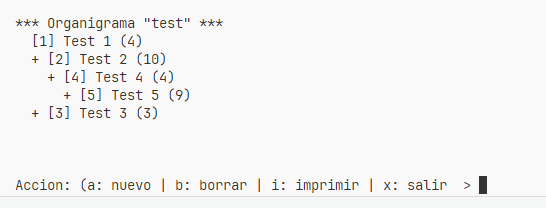

# Gestion de organigrama

Desarrollo de examen técnico

Consiste en gestionar areas de un organigrama:

1. Leer el codigo de area
2. Leer el nombre del area
3. Cantidad de personas del area
4. Leer el codigo del nodo padre si corresponde
5. permitir agregar, borrar, imprimir
